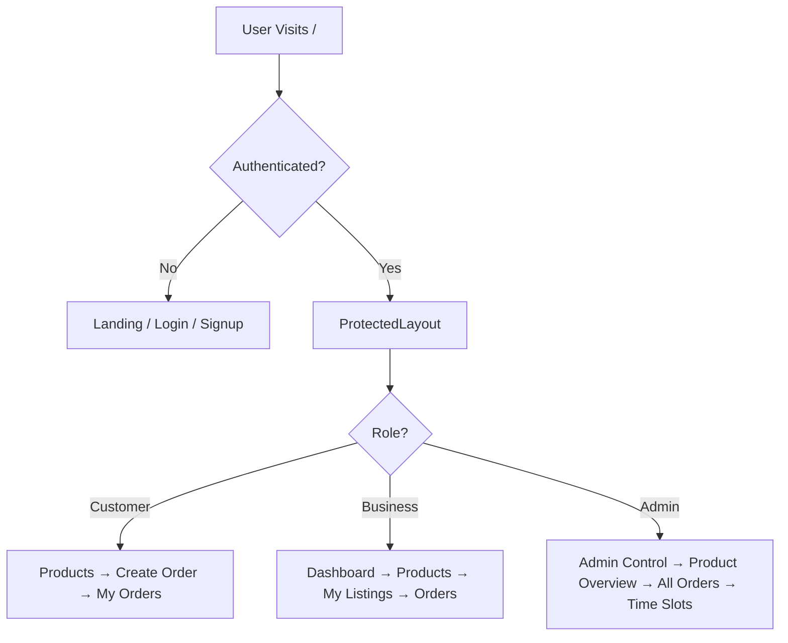
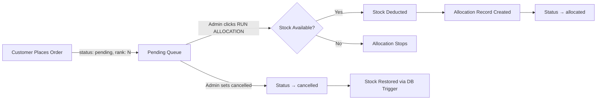

# 📦 LogiSys — Logistics Database Management System


A high-performance **Priority-Based Order Distribution System** built with **React 18**, **Vite**, **Tailwind CSS**, and **Supabase (PostgreSQL)**.

LogiSys enables multi-role inventory management with a **manual FIFO allocation workflow**: customers place orders that enter a pending queue, and admins manually trigger allocation to fulfil orders in strict first-in, first-out order while deducting stock.

---

## 📑 Table of Contents

- [Quick Start](#-quick-start)
- [Project Overview](#-project-overview)
- [Key Features](#-key-features)
- [Architecture Highlights](#-architecture-highlights)
- [Order Lifecycle](#-order-lifecycle)
- [Database Schema](#-database-schema)
- [Project Structure](#-project-structure)
- [Installation & Local Development](#-installation--local-development)
- [User Roles](#-user-roles)
- [Security](#-security)
- [Deployment](#-deployment)
- [Screenshots](#-screenshots)
- [Troubleshooting](#-troubleshooting)
- [Future Improvements](#-future-improvements)
- [Contributors](#-contributors)
- [License](#-license)

---

## ⚡ Quick Start

```bash
# 1. Clone the repository
git clone https://github.com/your-username/logisys.git
cd logisys

# 2. Install dependencies
npm install

# 3. Setup environment variables
echo "VITE_SUPABASE_URL=your_project_url" > .env
echo "VITE_SUPABASE_ANON_KEY=your_anon_key" >> .env

# 4. Start the development server
npm run dev
```

---

## 🚀 Project Overview

LogiSys addresses the problem of fair, priority-based inventory distribution. Orders are queued with an auto-incrementing FIFO rank, and an administrator manually runs allocation per product — processing pending orders sequentially, deducting stock, and recording allocation records.

### Core Purpose

- **Fair order processing** — strict FIFO ranking ensures first-come, first-served.
- **Manual allocation control** — admins decide when to fulfil pending orders.
- **Multi-role access** — Customers, Businesses, and Admins each have distinct capabilities.
- **Real-time inventory tracking** — stock is deducted only when allocation is executed.

---

## ✨ Key Features

| Feature | Description |
|---------|-------------|
| 🔐 **Secure RBAC** | Distinct capabilities for Customers, Businesses, and Admins enforced by Row Level Security (RLS). |
| 📊 **Admin Dashboard** | Centralized control panel to trigger FIFO allocation and monitor global stock levels. |
| ⏱️ **Capacity Tracking** | Recharts-powered analytics for time slot capacity utilization and live order feeds. |
| 📦 **Vendor Management**| Dedicated portals for businesses to create, manage, and monitor their own product listings. |
| 🛡️ **Atomic Triggers** | Database-level triggers ensure FIFO rank integrity and safely restore stock on cancellation. |

---

## 🏗️ Architecture Highlights

LogiSys utilizes a **hybrid architecture** that balances client-side responsibilities with rigorous database-level security.

- **Frontend Orchestration:** The React client handles the allocation workflow logic, rank assignment rendering, and capacity visualization.
- **Database Enforcement:** PostgreSQL enforces data integrity via RLS policies and cancellation triggers to prevent overselling and unauthorized modifications.

### Application Flow



---

## 🔄 Order Lifecycle



**Step-by-step:**

1. **Create Order** — Customer selects a product and quantity. The frontend inserts the order with `status: 'pending'`. The database trigger (`trg_assign_rank`) acts as the source of truth, calculating the next FIFO sequence number (`MAX(rank) + 1`) and safely overwriting any client-supplied rank to ensure strict sequential priority. Stock is **not** deducted at this point.
2. **Pending Queue** — The order sits in the queue with its assigned rank.
3. **Admin Runs Allocation** — From the Admin Control panel, the admin clicks "RUN ALLOCATION" on a product. The `runAllocation()` function:
   - Reads the product's `available_quantity`
   - Fetches all `pending` orders for that product, sorted by `rank` ASC then `created_at` ASC
   - For each order (in FIFO order): if stock ≥ order quantity, inserts an `allocations` record, updates the order status to `allocated`, and subtracts from available stock
   - Stops when stock is insufficient for the next queued order
   - Persists the remaining stock back to the `products` table
4. **Cancellation** — When an admin sets an order to `cancelled`, a database trigger (`trg_order_cancelled`) restores the product's `available_quantity` and frees any assigned time slot capacity.

---

## 💾 Database Schema

### Tables

#### `profiles`
| Column | Type | Description |
|--------|------|-------------|
| `id` | UUID (PK) | Links to `auth.users.id` |
| `email` | Text | User email |
| `name` | Text | Display name |
| `role` | Text | `customer`, `business`, or `admin` |
| `business_name` | Text | Business display name (nullable) |
| `business_id` | Text | Auto-generated 8-char business identifier (nullable) |

#### `products`
| Column | Type | Description |
|--------|------|-------------|
| `id` | UUID (PK) | Product identifier |
| `name` | Text | Product name |
| `description` | Text | Product description |
| `category` | Text | Product category |
| `status` | Text | `active` or `inactive` |
| `total_quantity` | Int | Total inventory |
| `available_quantity` | Int | Currently available stock |
| `created_by` | UUID (FK) | References `profiles.id` |

#### `orders`
| Column | Type | Description |
|--------|------|-------------|
| `id` | UUID (PK) | Order identifier |
| `user_id` | UUID (FK) | References `profiles.id` |
| `product_id` | UUID (FK) | References `products.id` |
| `quantity` | Int | Ordered quantity |
| `rank` | Int | FIFO sequence number |
| `status` | Text | `pending`, `allocated`, `fulfilled`, or `cancelled` |
| `slot_id` | UUID (FK) | References `time_slots.id` (nullable) |
| `created_at` | Timestamptz | Order timestamp |

#### `allocations`
| Column | Type | Description |
|--------|------|-------------|
| `id` | UUID (PK) | Allocation record identifier |
| `order_id` | UUID (FK) | References `orders.id` |
| `allocated_quantity` | Int | Quantity allocated |
| `allocated_at` | Timestamptz | Allocation timestamp |

#### `time_slots`
| Column | Type | Description |
|--------|------|-------------|
| `id` | UUID (PK) | Slot identifier |
| `slot_start` | Time | Window start |
| `slot_end` | Time | Window end |
| `max_capacity` | Int | Maximum capacity |
| `current_capacity` | Int | Currently used capacity |

### Active Database Triggers

| Trigger | Event | Function | Purpose |
|---------|-------|----------|---------|
| `trg_order_cancelled` | BEFORE UPDATE on `orders` | `handle_order_cancellation()` | When status changes to `cancelled`: restores `products.available_quantity` and frees `time_slots.current_capacity` |
| `trg_assign_rank` | BEFORE INSERT on `orders` | `assign_order_rank()` | Database source of truth for FIFO ranking. Overwrites any client-supplied rank to ensure strict sequential priority. |

### Row Level Security (RLS)

| Table | Policy | Rule |
|-------|--------|------|
| `profiles` | Users read own profile | `auth.uid() = id` |
| `profiles` | Admin reads all profiles | `is_admin()` (SECURITY DEFINER function) |
| `profiles` | Users update own name | `auth.uid() = id`, role cannot change |
| `profiles` | Service can insert profiles | `WITH CHECK (true)` — used by the signup trigger |
| `orders` | Users see own orders | `auth.uid() = user_id` |
| `orders` | Users insert own orders | `auth.uid() = user_id` |
| `orders` | Admin sees all orders | `is_admin()` subquery |
| `products` | Public product read | `USING (true)` |
| `products` | Business modifies own products | `auth.uid() = created_by` |
| `products` | Admin modifies all products | `is_admin()` subquery |

> **Note:** Admin access is verified via an `is_admin()` SECURITY DEFINER function that safely queries the `profiles` table without triggering RLS recursion.

---

## 💻 Tech Stack

| Layer | Technology |
|-------|-----------|
| Frontend | React 18, React Router v6 |
| Build Tool | Vite |
| Styling | Tailwind CSS, PostCSS, Autoprefixer |
| Charts | Recharts |
| Backend & Auth | Supabase (PostgreSQL, Auth, PostgREST) |
| Fonts | Inter (sans), DM Mono (monospace) |

---

## 📁 Project Structure

```
├── .env                        # Supabase URL and anon key
├── index.html                  # App entry point with font preloads
├── package.json                # Dependencies and scripts
├── vite.config.js              # Vite configuration
├── tailwind.config.js          # Tailwind theme extensions
├── postcss.config.js           # PostCSS plugins
├── src/
│   ├── App.jsx                 # Root router: public + protected routes
│   ├── ProtectedLayout.jsx     # Auth gate, role detection, sidebar + route rendering
│   ├── main.jsx                # React DOM root with AuthProvider
│   ├── index.css               # Global styles, CSS variables, Tailwind directives
│   ├── components/
│   │   ├── Sidebar.jsx         # Role-aware collapsible navigation
│   │   ├── StatCard.jsx        # KPI metric display card
│   │   ├── PageHeader.jsx      # Consistent page title component
│   │   ├── LoadingSkeleton.jsx # Shimmer loading placeholders
│   │   └── EmptyState.jsx      # Empty data state display
│   ├── context/
│   │   └── AuthContext.jsx     # Supabase session, profile fetch, sign in/up/out
│   ├── lib/
│   │   └── supabaseClient.js   # Supabase client initialization with null guard
│   ├── pages/
│   │   ├── Landing.jsx         # Marketing splash page
│   │   ├── Login.jsx           # Email/password sign in
│   │   ├── Signup.jsx          # Customer/Business account creation
│   │   ├── Products.jsx        # Product catalog with search and details
│   │   ├── CreateOrder.jsx     # Order placement form with category filter
│   │   ├── Orders.jsx          # Customer order history with allocation data
│   │   ├── Dashboard.jsx       # Business/Admin overview with Recharts
│   │   ├── Profile.jsx         # User profile display and name editing
│   │   ├── BusinessListings.jsx # Business product CRUD management
│   │   ├── AdminDashboard.jsx  # Admin control panel with RUN ALLOCATION
│   │   ├── AdminOrders.jsx     # All orders view with status management
│   │   ├── AdminProducts.jsx   # Admin inventory listings
│   │   ├── AdminProductOverview.jsx # Product analytics charts
│   │   └── TimeSlotMonitor.jsx # Time slot capacity monitoring
│   └── services/
│       └── orderService.js     # runAllocation() FIFO allocation logic
```

---

## ⚙️ Installation & Local Development

### Prerequisites

- [Node.js](https://nodejs.org/) v18 or higher
- A [Supabase](https://supabase.com/) project with the required tables, triggers, and RLS policies

### Supabase Database Setup

In the Supabase SQL Editor, ensure the following are configured:

1. **Tables**: `profiles`, `products`, `orders`, `allocations`, `time_slots`
2. **Profile trigger**: `handle_new_user()` on `auth.users` INSERT — auto-creates a `profiles` row with role from `user_metadata`
3. **Cancellation trigger**: `handle_order_cancellation()` on `orders` UPDATE — restores stock and frees time slot capacity when an order is cancelled
4. **RLS policies**: Enable RLS on `profiles`, `orders`, and `products` with the policies listed in the Database Schema section above
5. **`is_admin()` function**: A `SECURITY DEFINER` function that checks if `auth.uid()` has `role = 'admin'` in `profiles`
6. **Time slots**: Insert default delivery windows into `time_slots`

---

## 👥 User Roles

### Customer
The default account type. Customers can:
- Browse the product catalog with category filtering and search
- Place orders (creates a `pending` order with FIFO rank)
- View their order history with status and allocation data

### Business
Vendor accounts. In addition to customer capabilities, businesses can:
- Create, edit, and delete their own product listings
- Set total and available inventory quantities
- Access the Distribution Dashboard with order metrics and capacity charts

### Admin
System operators with full platform access:
- **Admin Control**: View all products with stock levels and trigger FIFO allocation per product
- **All Orders**: View, filter, and update the status of any order in the system
- **Product Overview**: Inventory analytics across all listings
- **Time Slots**: Monitor delivery window capacity utilization
- **Listings**: Admin-level product management

---

## 🔒 Security

### Authentication
- Supabase Auth handles user registration, login, and JWT token management
- Sessions are persisted locally with `persistSession: true` and auto-refreshed
- The `AuthContext` provides session state to all protected routes

### Authorization
- **Client-side**: `ProtectedLayout.jsx` reads the user's role from the `profiles` table and conditionally renders routes — admin/business routes are not present in the DOM for unauthorized roles
- **Server-side**: PostgreSQL RLS policies enforce data access at the database level
- **Admin verification**: The `is_admin()` SECURITY DEFINER function queries `profiles` directly, avoiding RLS recursion that would occur with inline policy subqueries on the same table

### Data Protection
- Business users can only modify products where `created_by = auth.uid()`
- Customers can only read/insert their own orders
- Profile role changes are blocked by RLS `WITH CHECK` constraints
- The signup trigger runs as `SECURITY DEFINER` to bypass RLS when inserting new profiles

---

## 🚀 Deployment

Build the production bundle:

```bash
npm run build
```

The compiled assets are output to the `/dist` directory. Deploy to any static hosting provider (Vercel, Netlify, Cloudflare Pages). Configure the host to redirect all 404 traffic to `index.html` for client-side routing support.

---

## 📸 Screenshots

- **Landing Page** — Marketing splash with feature highlights
- **Login / Signup** — Authentication forms with role toggle
- **Product Catalog** — Searchable product grid with detail panels
- **Create Order** — Category-filtered order form with stock display
- **Order History** — Status table with allocation quantities
- **Admin Control** — Product cards with RUN ALLOCATION buttons
- **Admin Orders** — Filterable order management table
- **Time Slot Monitor** — Capacity utilization cards and progress bars
- **Business Listings** — CRUD interface for vendor products
- **Dashboard** — Recharts capacity charts and order metrics

---

## 🔧 Troubleshooting

| Issue | Cause | Fix |
|-------|-------|-----|
| UI stuck on loading spinner | Missing `.env` variables | Ensure `VITE_SUPABASE_URL` and `VITE_SUPABASE_ANON_KEY` are set correctly |
| `42P17 infinite recursion` on profiles | RLS policy on `profiles` queries `profiles` for admin check | Use the `is_admin()` SECURITY DEFINER function instead of inline subqueries |
| Orders show "Unknown" product name | FK join hint mismatch | Ensure the query uses `products!orders_product_id_fkey(name)` |
| Allocation does nothing | No pending orders, or all pending orders exceed available stock | Check that orders exist with `status = 'pending'` and the product has `available_quantity > 0` |
| Cancelled order doesn't restore stock | Missing cancellation trigger | Run the `handle_order_cancellation()` trigger SQL in Supabase |
| Business can't create products | Missing RLS INSERT policy | Add `WITH CHECK (auth.uid() = created_by)` policy for INSERT on products |
| Styles not loading | Tailwind needs the Vite build step | Run `npm run dev`, don't open the HTML file directly |

---

## 🔮 Future Improvements

- **Database-level allocation**: Move `runAllocation()` to a PostgreSQL function via `supabase.rpc()` for atomicity and race-condition safety
- **Payment integration**: Add Stripe checkout before order finalization
- **Notification system**: Supabase Database Webhooks for email/SMS on allocation completion
- **Dynamic time slots**: Admin interface to create/modify delivery windows
- **Mobile-first sidebar**: Drawer-based navigation for small screens
- **Real-time updates**: Supabase Realtime subscriptions for live order/stock changes

---

## 👥 Contributors

This project is maintained by a dedicated team of developers. Contributions, issues, and feature requests are always welcome!

- **Your Name** - *Lead Developer* - [@your-username](https://github.com/your-username)

---

## 📄 License

Distributed under the MIT License. See `LICENSE` for more information.
