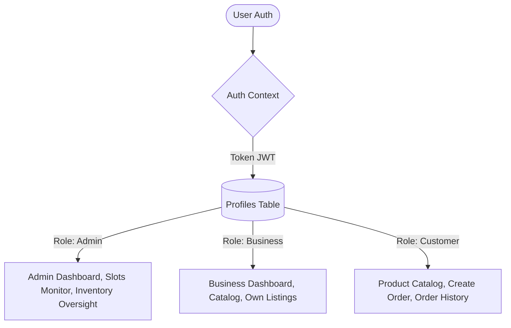

# 📦 LogiSys (Logistics Database Management System)

A state-of-the-art, high-performance **Logistics and Priority-Based Order Distribution System** built with **React**, **Vite**, **Tailwind CSS**, and **Supabase (PostgreSQL)**. 

LogiSys provides a robust dashboard, real-time inventory tracking, multi-role authorization (Admins, Businesses, and Customers), and a fully automated, transactional FIFO (First-In, First-Out) time-slot allocation engine running directly on the database level.

---

## 🚀 Project Overview

LogiSys solves the complex problem of fair, priority-based inventory allocation and delivery scheduling. By pushing complex business logic down to the PostgreSQL database layer (using triggers and row-level locks), the system guarantees transactional safety, prevents overselling race conditions, and ensures strict First-In, First-Out (FIFO) processing.

### Core Features

*   **Authentication & RBAC:** Secure email/password login with strict Role-Based Access Control dividing users into **Customers**, **Businesses**, and **Admins**.
*   **Product Management:** Businesses can list custom inventory. Admins have global oversight.
*   **FIFO Queue System:** Orders are automatically ranked on insertion to guarantee strict processing priority.
*   **Automated Allocation System:** Orders are atomically matched to the earliest available delivery `time_slots` window based on capacity.
*   **Inventory Tracking:** Stock is automatically deducted upon order creation and safely restored if an order is cancelled.
*   **Analytics Dashboards:** Real-time data visualization using Recharts for admins and businesses.

---

## 🏗️ Architecture Overview

LogiSys relies heavily on a "Thick Database, Thin Client" architecture. The React frontend handles presentation, routing, and user input, while Supabase handles authentication, authorization (RLS), and business logic execution (Triggers/Functions).

### User & Role Flow



---

## 💾 Database Schema

The PostgreSQL database on Supabase is fully relational and heavily utilizes triggers for atomic operations.

### Tables & Columns

*   **`profiles`**: Central user metadata.
    *   `id` (UUID, PK) -> Links to `auth.users`
    *   `email` (Text), `name` (Text)
    *   `role` (Text: `customer` | `business` | `admin`)
    *   `business_name` (Text), `business_id` (Text)
*   **`products`**: Active inventory listings.
    *   `id` (UUID, PK)
    *   `name` (Text), `description` (Text), `category` (Text), `status` (Text)
    *   `total_quantity` (Int), `available_quantity` (Int)
    *   `created_by` (UUID -> `profiles.id`)
*   **`orders`**: Customer and Business orders.
    *   `id` (UUID, PK)
    *   `user_id` (UUID -> `profiles.id`)
    *   `product_id` (UUID -> `products.id`)
    *   `quantity` (Int), `rank` (Int - FIFO Sequence)
    *   `status` (Text: `pending` | `allocated` | `fulfilled` | `cancelled`)
    *   `slot_id` (UUID -> `time_slots.id`)
*   **`time_slots`**: Delivery capacity windows.
    *   `id` (UUID, PK)
    *   `slot_start` (Time), `slot_end` (Time)
    *   `max_capacity` (Int), `current_capacity` (Int)
*   **`allocations`**: Junction mapping for fulfilled capacity.
    *   `id` (UUID, PK)
    *   `order_id` (UUID -> `orders.id`)
    *   `allocated_quantity` (Int), `allocated_at` (Timestamptz)

### Database Triggers & Functions

To prevent frontend race conditions, LogiSys executes core logic atomically via PostgreSQL triggers on the `orders` table:

1.  **`trg_process_order` (BEFORE INSERT)**: Locks the product row (`FOR UPDATE`), verifies sufficient `available_quantity`, deducts the stock, and scans `time_slots` to assign the earliest window with available capacity. Updates the slot's `current_capacity` and assigns the `slot_id` to the order.
2.  **`trg_assign_rank` (BEFORE INSERT)**: Calculates and assigns the `rank` dynamically based on existing orders for the product to enforce strict FIFO.
3.  **`trg_create_allocation` (AFTER INSERT)**: Automatically inserts a record into the `allocations` table mapping the `order_id` to the quantity fulfilled.
4.  **`trg_order_cancelled` (BEFORE UPDATE)**: If an order's status changes to `cancelled`, this trigger safely restores the `available_quantity` on the product and frees up the `current_capacity` on the assigned `time_slots`.

---

## 🔒 Security

*   **Authentication**: Managed by Supabase Auth (JWTs).
*   **Authorization**: Handled client-side via React Router boundaries (`ProtectedLayout.jsx`) and server-side via PostgreSQL Row Level Security (RLS).
*   **Row Level Security (RLS)**:
    *   **Profiles**: Safely references `auth.jwt() -> 'user_metadata' ->> 'role'` to prevent infinite recursion during admin checks. Users can read/update their own profiles.
    *   **Orders**: Customers can only SELECT and INSERT their own orders. Admins can view all orders.
    *   **Products**: Publicly readable. Businesses can only mutate products where `auth.uid() = created_by`.

---

## 💻 Tech Stack

*   **Frontend Library**: React 18
*   **Build Tool**: Vite
*   **Routing**: React Router v6
*   **Styling**: Tailwind CSS & PostCSS
*   **Data Visualization**: Recharts
*   **Backend & Database**: Supabase (PostgreSQL, Auth, PostgREST)

---

## 📁 Project Structure

```bash
├── .env                    # Supabase environment variables
├── index.html              # App entry HTML
├── package.json            # Dependencies and scripts
├── src/
│   ├── App.jsx             # Root router configuration
│   ├── ProtectedLayout.jsx # Role-based boundary & navigation shell
│   ├── main.jsx            # React DOM root
│   ├── index.css           # Global Tailwind & Theme variables
│   ├── components/         # Reusable UI (Sidebar, StatCards, Spinners)
│   ├── context/            # AuthContext for session management
│   ├── lib/                # Supabase client initialization
│   ├── pages/              # Application Views
│   │   ├── Landing.jsx & Login.jsx & Signup.jsx
│   │   ├── Dashboard.jsx & Profile.jsx
│   │   ├── Products.jsx & Orders.jsx & CreateOrder.jsx
│   │   ├── BusinessListings.jsx
│   │   └── AdminDashboard.jsx, AdminOrders.jsx, AdminProducts.jsx, TimeSlotMonitor.jsx
│   └── services/           # External API utilities
└── tailwind.config.js      # Utility class definitions
```

---

## ⚙️ Installation & Local Development

### Prerequisites

*   [Node.js](https://nodejs.org/) (v18 or higher)
*   A [Supabase](https://supabase.com/) account and active project

### 1. Clone & Install

```bash
git clone https://github.com/your-username/logisys.git
cd logisys
npm install
```

### 2. Environment Setup

Create a `.env` file in the root directory and populate it with your Supabase keys:

```env
VITE_SUPABASE_URL=https://your-project.supabase.co
VITE_SUPABASE_ANON_KEY=your_anon_public_key
```

### 3. Database Initialization

Ensure your Supabase PostgreSQL instance has the required tables (`profiles`, `products`, `orders`, `time_slots`, `allocations`), RLS policies, and triggers deployed. 

### 4. Start Development Server

```bash
npm run dev
```

The application will be accessible at `http://localhost:5173`.

---

## 👥 User Roles & Workflows

### Customer
The default role. Customers can browse the active product catalog, place orders, and view their order history/FIFO queue ranking.

### Business
Vendor accounts. Businesses have access to the `BusinessListings` view where they can create, manage, and monitor the stock of their own specific products. They can also place personal orders.

### Admin
System operators. Admins have access to global dashboards, can view and cancel any order across the system, monitor `time_slots` capacity utilization, and oversee all active product listings.

---

## 📸 Screenshots

*(Placeholders for application screenshots)*

*   **Login & Authentication**: `[Screenshot: Landing & Login Page]`
*   **Admin Dashboard**: `[Screenshot: Global Metrics & Order Feed]`
*   **Product Catalog**: `[Screenshot: Product Grid & Search]`
*   **Time Slot Monitor**: `[Screenshot: Allocation Capacity Bars]`

---

## 🚀 Deployment

LogiSys is a standard React SPA and can be deployed to any static hosting provider (Vercel, Netlify, Cloudflare Pages, etc.).

1. Build the production bundle:
   ```bash
   npm run build
   ```
2. The compiled assets will be output to the `/dist` directory. Ensure your hosting provider is configured to redirect all 404 traffic to `index.html` to support client-side routing.

---

## 🔧 Troubleshooting

*   **UI stuck in endless loading state:** Ensure your `.env` variables are correctly set. If `VITE_SUPABASE_URL` is missing, the AuthContext cannot initialize.
*   **"Infinite recursion" database error:** This occurs if the RLS policy on the `profiles` table attempts to query the `profiles` table to check admin status. Ensure the policy uses `auth.jwt() -> 'user_metadata'` instead.
*   **Orders failing to place:** Check the `time_slots` table. If the table is empty or all slots are at `max_capacity`, the allocation trigger will fail.
*   **Missing Styles:** Ensure you are running `npm run dev` and not just opening the HTML file, as Tailwind requires the Vite build step to compile CSS classes.

---

## 🔮 Future Improvements

*   **Stripe Integration**: Add payment capture prior to finalizing the order insertion.
*   **Webhooks**: Implement Supabase Database Webhooks to trigger email/SMS notifications upon successful time slot allocation.
*   **Dynamic Time Slots**: Create an admin interface to dynamically generate and alter future time slots beyond the daily defaults.
